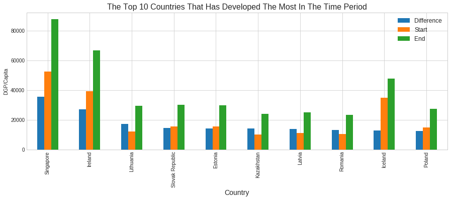
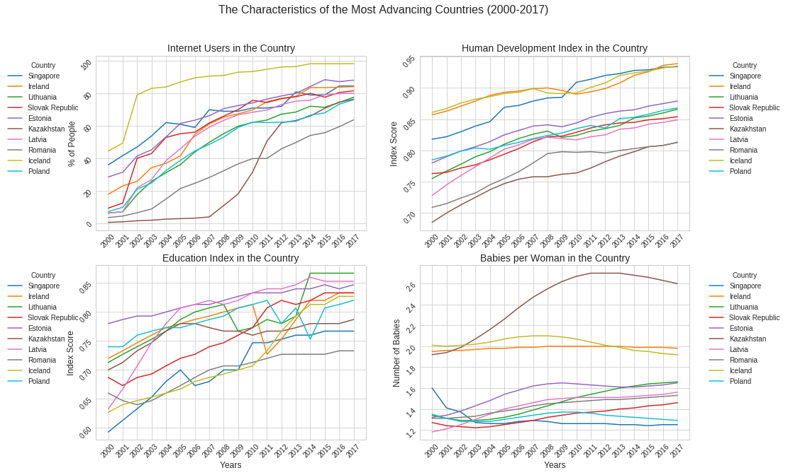
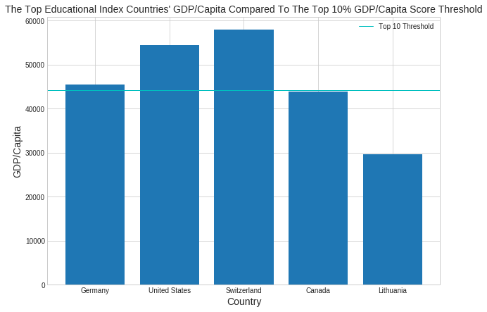
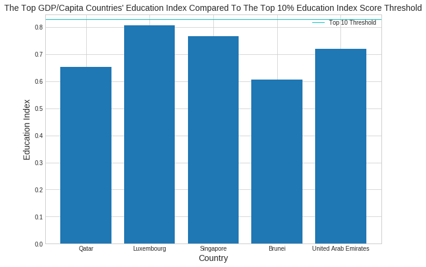

# NANODGREE FIRST PROJECT 
# GapMinder-Analysis
## Conclusions 

### Which countries has developed the most (GDP / Capita) in the choosen time period (2000 - 2017)?
 - Singapore, Ireland, Lithuania, Slovak Republic, Estonia,
       Kazakhstan, Latvia, Romania, Iceland, Poland

       
### What are the characteristics of these countries that has developed the most in the time period?
- Over the years in the time period:  
 - Increasing Number of Internet Users.
 - Increasing Educational Index.
 - Increasing Human Development Index.
 - Lower Fertility rates below 2.0 and sometime below 1.6 except for Kazakhstan

### Do these countries have higher educational index or other index because they have a higher GDP/Capita or they have a higher GDP/Capita because they have a higher educational index?
- Having a really high Education Index can guarantee you to have a really high GDP/Capita even among the top 10% But having the highest GDP/Capita can't guarantee you to have the highest Education Index top 10% but still can get you a relatively high score to be among the top countries.

Countries with the highest Education Index             |  Countries with the highest GDP/Capita
:-------------------------:|:-------------------------:
 | 
